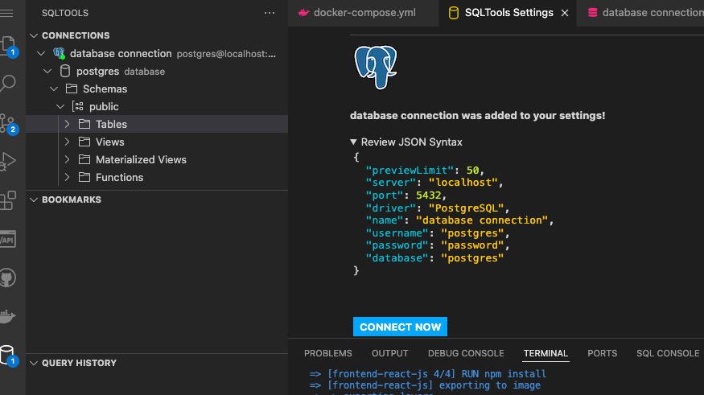

# Week 1 — App Containerization

I was able to complete all the required assessments without issue.

I have added the required "notifications" code for both backend and frontend parts. I had an issue with typos, but I was able to solve it quickly by looking at container's logs.

I haven't found the mentioned db-plugin for GitPod, but I was able to use another one and successfully connected to my local PostgreSQL database.

