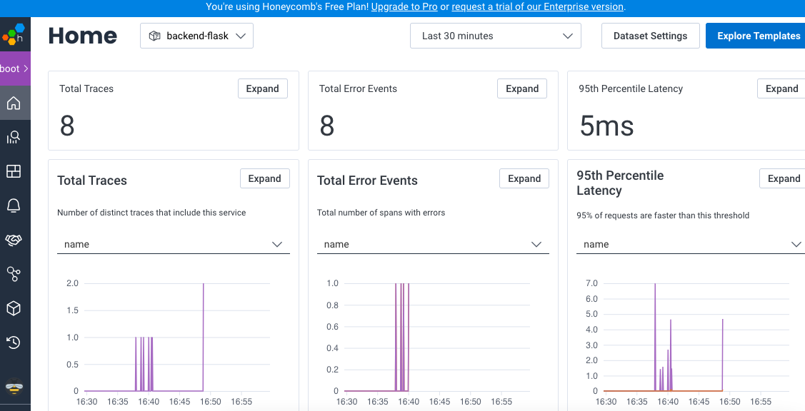
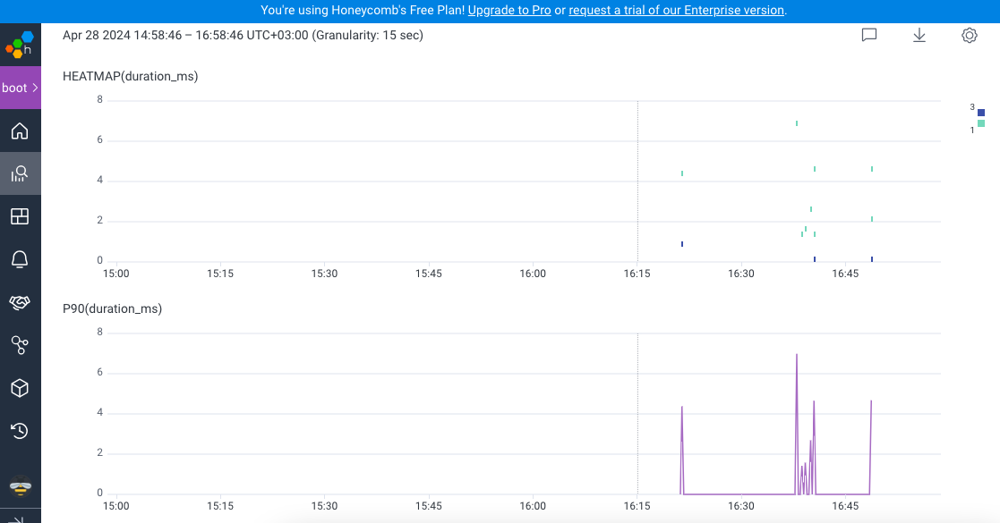
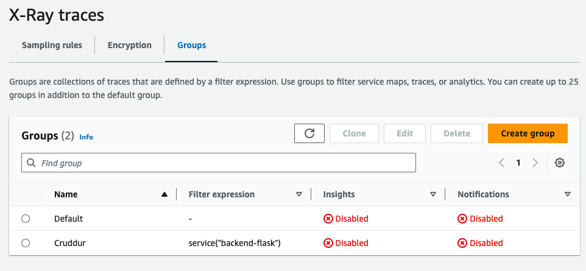
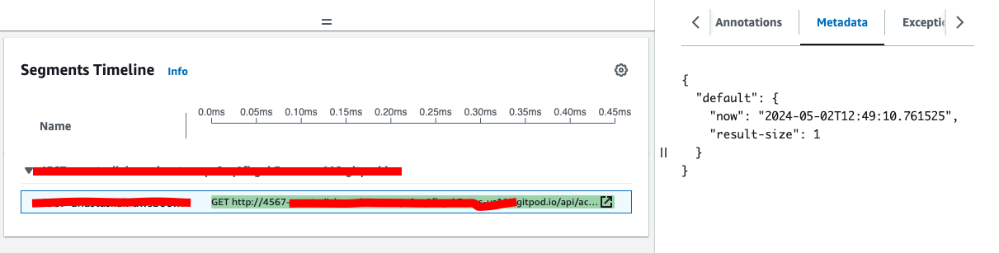
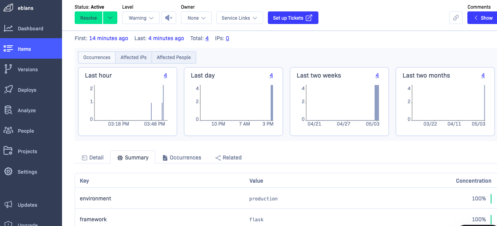

# Week 2 — Distributed Tracing

I was able to complete all the required assessments without issue.

I added HoneyComb tracing and XRay. I comment the code of XRay, because of billing issues.


HoneyComb monitoring:


Query:


XRay Group:


I was able to come up with a solution for XRay custom metadata:


I added a rollbar to Backend:


I faced an issue of an error with 
```
@app.before_first_request
```
so I changed this line to a line provided by Rollbar directly:
```
with app.app_context():
```
