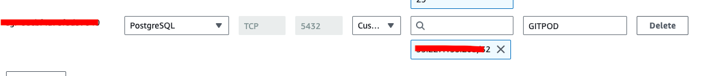
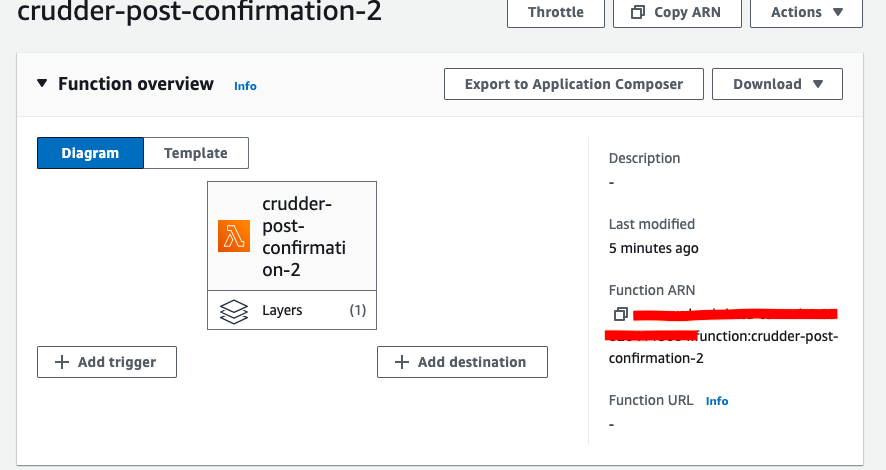

# Week 4 — Postgres and RDS

I was able to complete all the required assessments. I had two issues, about which I'll tell further.

Firstly, I had an issue with PostgreSQL version:

I was able to fix it with the correct version and connect to AWS RDS:

My security group:

My created AWS-lambda:

Error with code from Andrew source:

I fixed it with determined params as in Andrews videos.

Then, I implemented creating activities with Andrew, but there is a missed error with no-passing right handle

I was not able to fix it yet. I guess I need to take it from jwt somehow.
