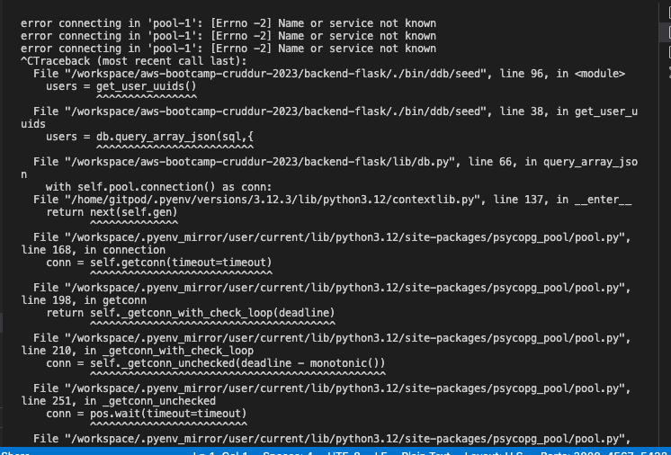
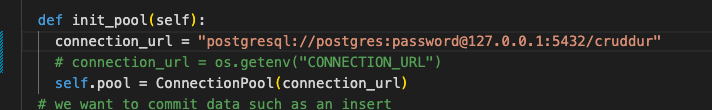
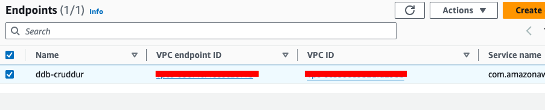
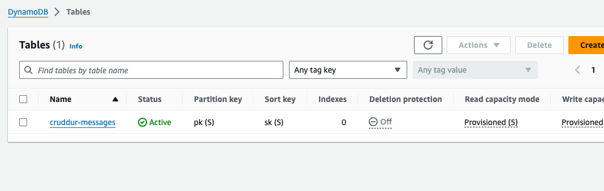
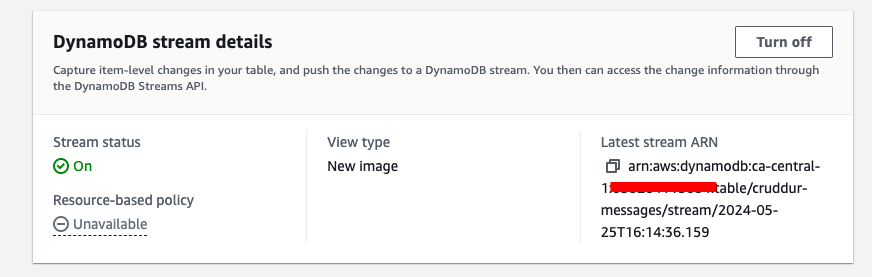
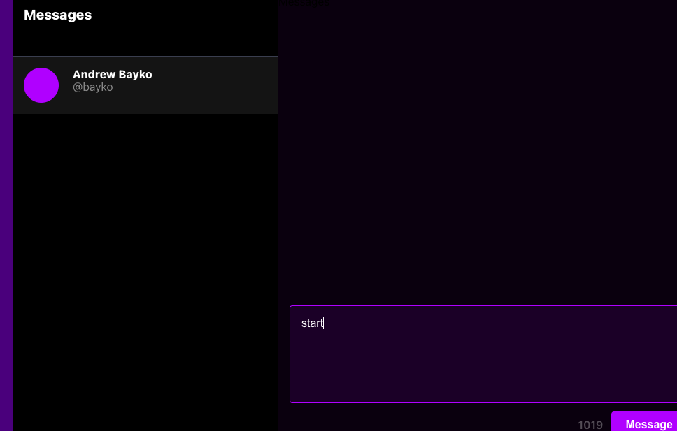

# Week 5 — DynamoDB and Serverless Caching

This week was really hard to follow.
First issue that I came across was db (Postgres) name when we tried to input seed data in DynamoDB.

I understood that the problem was with our connection_url, for Docker it should be with "db:5432". The only way I could fix it is to hardcode for script the other name

When I had troubles with handles from our local PQSL seed data and my real Cognito users, it didn't match, because I thought it doesn't matter how to call your user, but it really matters. I had to create one more user 'bayko' in Cognito for that and also change the handle for Andrew's handle.

In AWS I had no issues to create all entities

VPC Endpoint:

DDB Table:

DDB Stream:

I was not able to send a message, I assume because of my different handles again, I had no time to investigate problem, so maybe next week I'll be able to come up with a solution.

