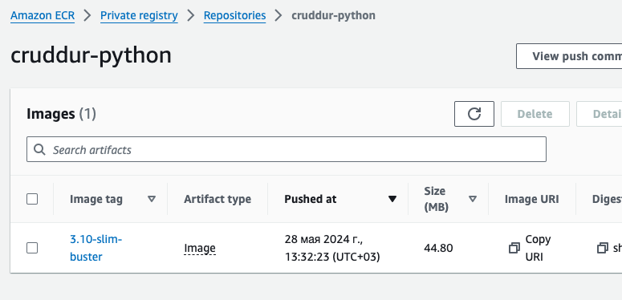
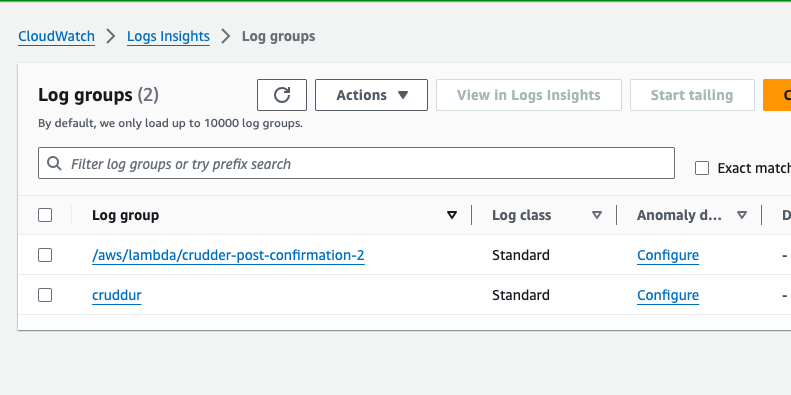
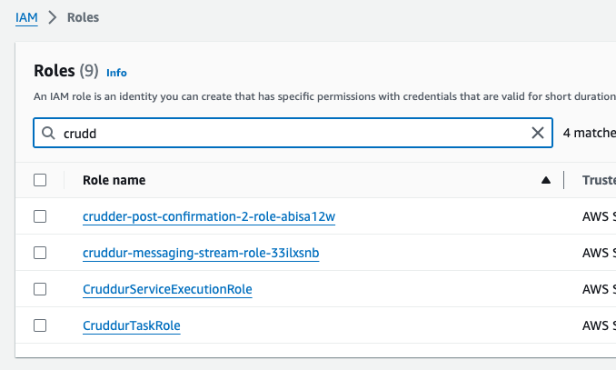
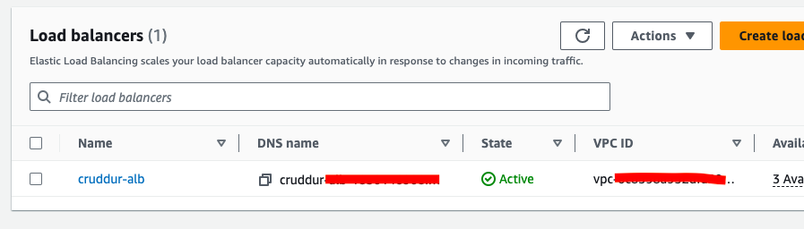
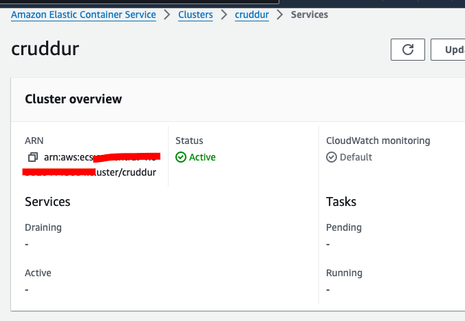
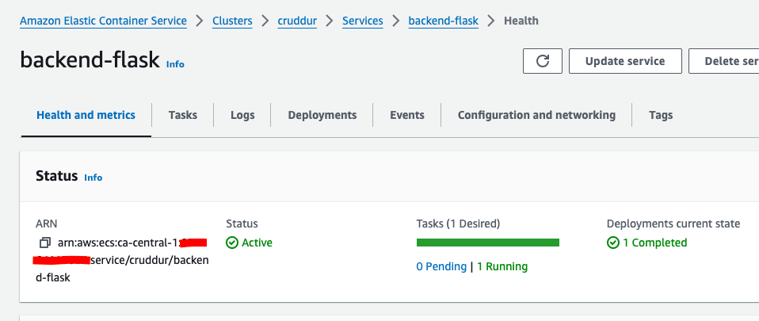
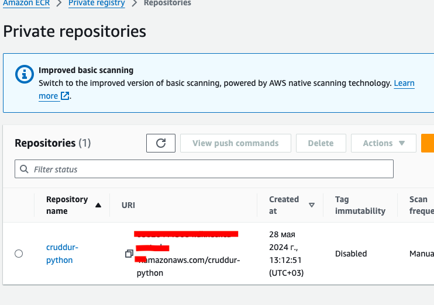
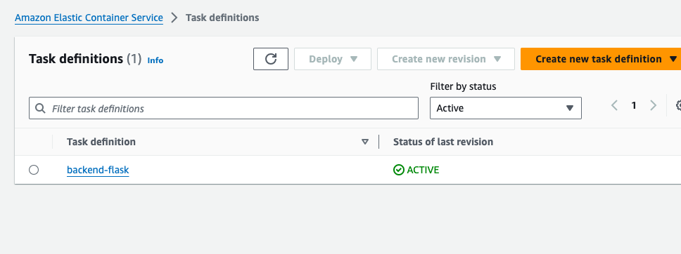
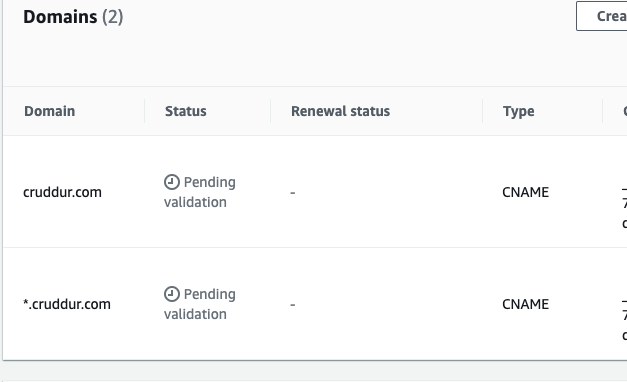

# Week 6 — Deploying Containers

I was able to complete the required assessments. But after setting everything in AWS I found that my budget had grown extremely because of usage of VPC (more than $2 for 2 days). Also, Rout 53 is very expensive and I could not create a public domain for service. So I was forced to delete my VPC and Route 53  and therefore I will maybe watch for the next weeks and try to do it without a real implementation in AWS.

My backend image in AWS:

Created log group in Cloud Watch

Created custom roles:

Set up load balancer:

Created cluster:

Services:

Created ECR:

Fargate task:

And finally, I waited for a long time but my certificates were still pending:

