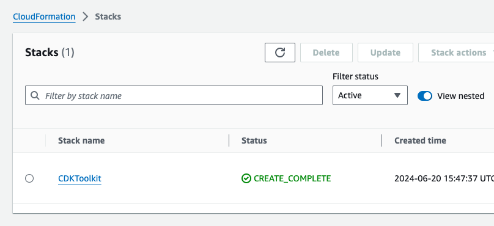
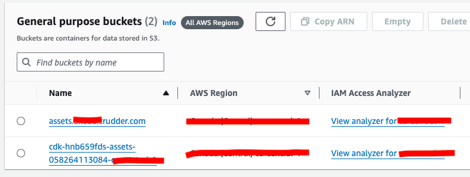
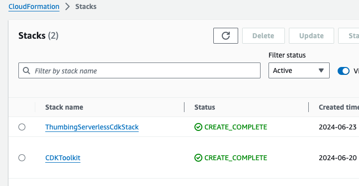
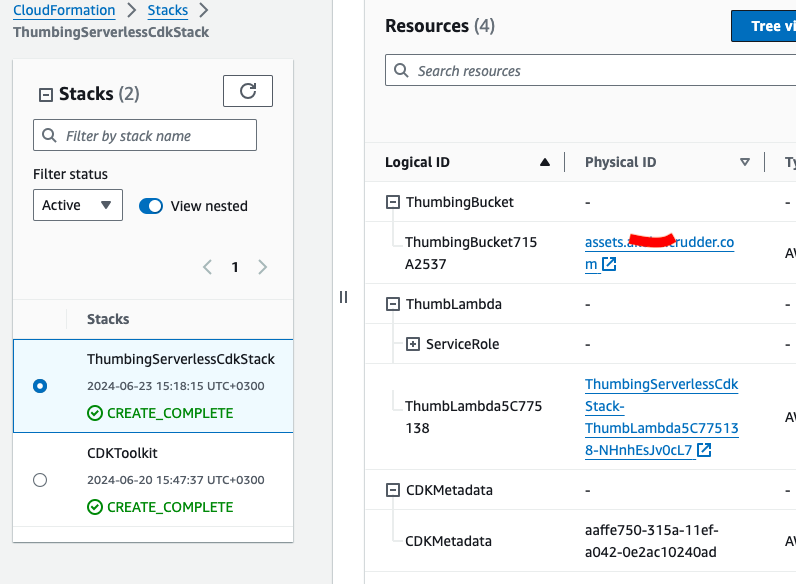
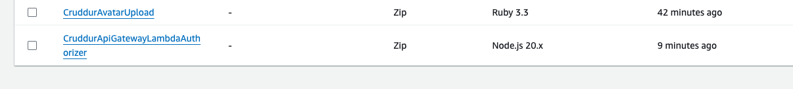

# Week 8 — Serverless Image Processing

This week was hard to follow, I barely understood what we were doing and for what. I got the main idea, but the implementation was not all. It would be better if Andrew painted it, like some scratch, as it was in previous weeks.

I added CDK and did the required stuff. I liked the expert of this week, she explained perfectly.

Cloud formation stuff:

Lambdas:

