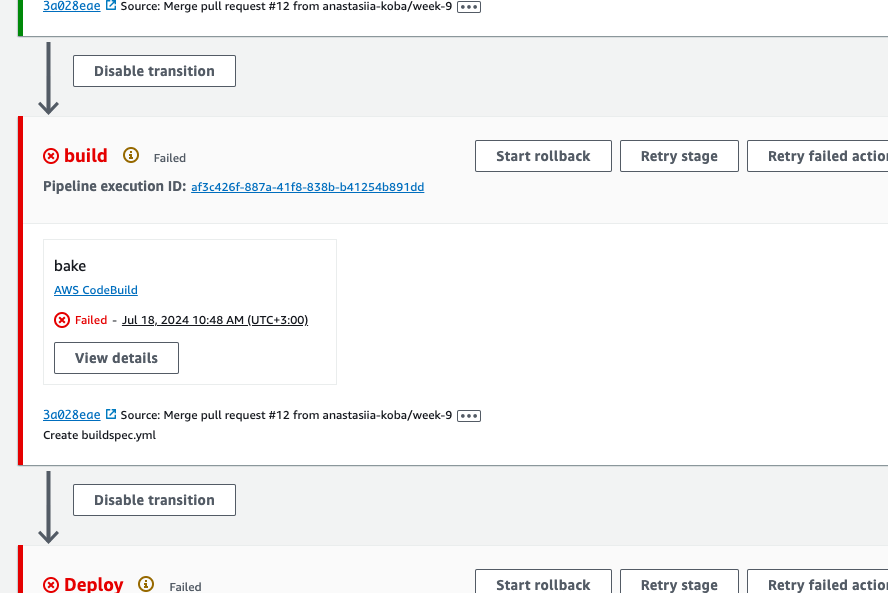
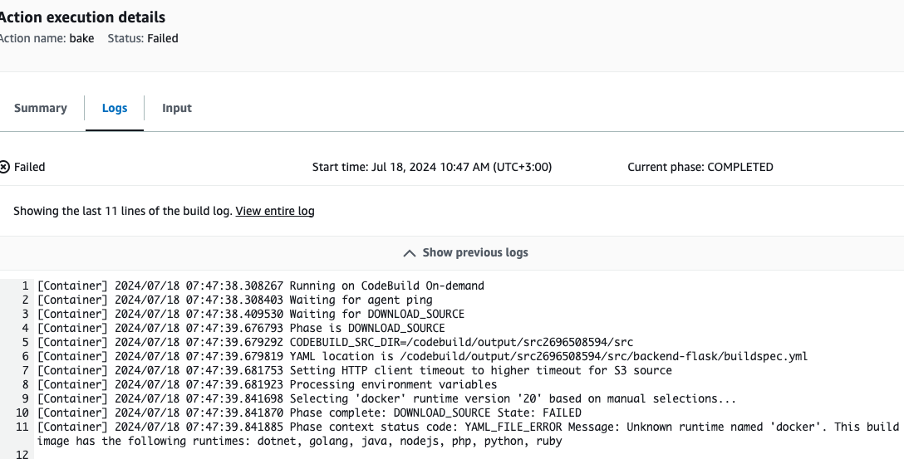

# Week 9 — CI/CD with CodePipeline, CodeBuild and CodeDeploy

Despite the fact, that it was the easiest week. I faced a problem in my pipeline build stage. And so far I haven't solved it.
Also, I try to avoid any AWS spending, so I'm not motivated to really deploy services to fargate.

Error log:

